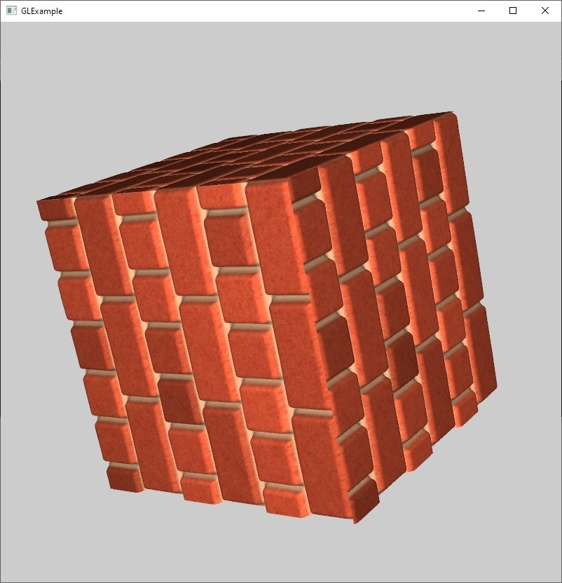

# GLExample

This is a simple example of an OpenGL application. The code is written to demonstrate an exact sequence of actions you have to perform in order to run a 3D application using OpenGL, so no homemade frameworks, just a single main function. Some code duplication was intentionally left to make the sequence simple. Code not directly related to OpenGL is moved to helper classes.

The code is based on https://www.opengl-tutorial.org/

Tools:

* MinGW version 7.3.0
* GLEW v2.1.0
* GLFW v3.2.1
* GLM v0.9.9.0

Build and Run:

* Open project in QtCreator
* Go to Project->Build and set up environement variables (change paths according to your environment):
  * GLEW_INC=C:\Lib\glew-2.1.0\include
  * GLEW_LIB=C:\Lib\glew-2.1.0\build\cmake\build\lib
  * GLFW_INC=C:\Lib\glfw-3.2.1\include
  * GLFW_LIB=C:\Lib\glfw-3.2.1\build\src
  * GLM_INC=C:\Lib\glm-0.9.9.0
  * STD_LIB=C:\Lib\Qt_5.12.2\Tools\mingw730_32\i686-w64-mingw32\lib
* Go to Project->Run and set up work catalog to GLExample
* Build and Run

Run from command line:
* Change current catalog to GLExample
* Run gla.exe
